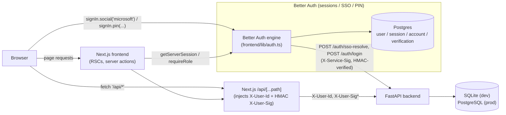

# Architecture overview

## Data flow

Two separate flows share the same backend:

1. **Data flow** — the browser talks to the Next.js frontend for pages, and to the Next.js
   `/api/[...path]` route handler (`frontend/app/api/[...path]/route.ts`) for every backend call.
   That route handler strips any client-supplied `X-User-Id`/`X-User-Sig*` headers, resolves the
   signed-in user's `backendUserId` from the Better Auth session, and re-signs the request with a
   fresh HMAC before forwarding it to FastAPI. FastAPI reads registrations, reports, locations, and
   users from SQLite (dev) or PostgreSQL (prod).
2. **Auth flow** — Better Auth (`frontend/lib/auth.ts`) owns sign-in, sessions, and its own
   PostgreSQL tables (`user`, `session`, `account`, `verification`), independent of the backend's
   database. It calls the backend twice, both times as a signed service-to-service caller (an
   `X-Service-Sig*` HMAC triple, distinct from the per-user `X-User-Sig*` header used on proxied
   data calls): once to resolve an SSO identity to a backend user (`POST /auth/sso-resolve`) and
   once to verify PIN credentials (`POST /auth/login`).

See [Data model]({{ site.baseurl }}/architecture/data-model/) for what's actually stored on each
side, and [Authentication]({{ site.baseurl }}/architecture/authentication/) for the full sign-in
flows and the two distinct HMAC header schemes shown above.

## Trust boundaries

- **The backend never trusts client-supplied identity.** Every backend endpoint that needs to know
  "who is calling" reads it from an `X-User-Id` header injected by the Next.js proxy — never from a
  browser-supplied value. The browser cannot reach the backend directly (`BACKEND_API_URL` is a
  server-only env var with no `NEXT_PUBLIC_` prefix), so it has no way to set that header itself.
- **The browser never calls the backend directly.** All data reads and writes go through
  same-origin `/api/*` routes. This keeps `BACKEND_API_URL` and `BACKEND_SHARED_SECRET` out of any
  client bundle and gives the Next.js server a single choke point to enforce session checks and
  inject identity.
- **`proxy.ts` (Next.js 16's renamed `middleware.ts`) is optimistic only.** It checks for the
  presence of the Better Auth session cookie and redirects to `/login` if absent, but it does not
  validate the session against Postgres — that would require a database round trip from the edge.
  The real authorization boundary is server-side: `requireSession()` / `requireRole()`
  (`frontend/lib/server-session.ts`) in RSCs and server actions, and the session validation inside
  `app/api/[...path]/route.ts` itself.
- **Two separate signature schemes, one shared secret.** Both the per-request user-identity header
  (`X-User-Sig*`) and the service-to-service header (`X-Service-Sig*`) are HMAC-SHA256 over a
  `version.timestamp.subject` payload, signed with the same `BACKEND_SHARED_SECRET`. The backend
  fully verifies the service-to-service signature (`verify_service_auth` /
  `verify_service_hmac` in `backend_fast_api/src/hgs_refuce_app/auth.py` and `main.py`) before
  accepting `/auth/login` or `/auth/sso-resolve`. It does **not** yet verify the per-user
  `X-User-Sig` on proxied calls — `get_user_id()` currently trusts whatever `X-User-Id` header it
  receives. This is a known, tracked gap (see
  [Decisions]({{ site.baseurl }}/architecture/decisions/)), not an oversight the frontend can
  compensate for.
- **The backend is the source of truth for roles and location membership.** Better Auth stores
  identity only (`backendUserId`); role and location are fetched live from FastAPI's
  `GET /currentUser` on every request that needs them, never cached on the session or mirrored onto
  the Better Auth user row.

## Where to go next

- [Authentication]({{ site.baseurl }}/architecture/authentication/) — the two sign-in flows, the HMAC scheme, and the three roles.
- [Data model]({{ site.baseurl }}/architecture/data-model/) — the actual Pydantic models behind `/locations`, `/registrations`, and `/reports`.
- [Decisions]({{ site.baseurl }}/architecture/decisions/) — why the system is built this way, and what it explicitly reversed.
- [Getting Started]({{ site.baseurl }}/getting-started/) — run this stack yourself.
